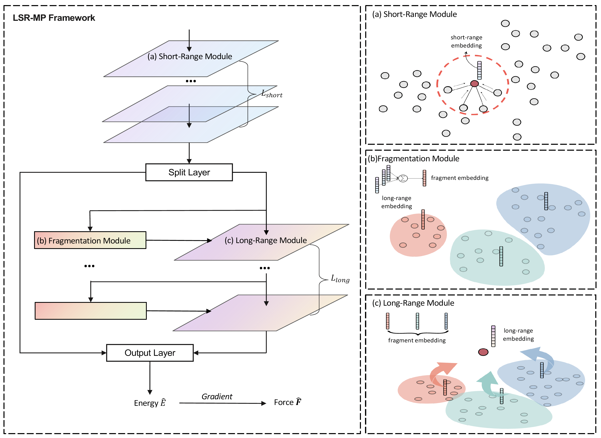
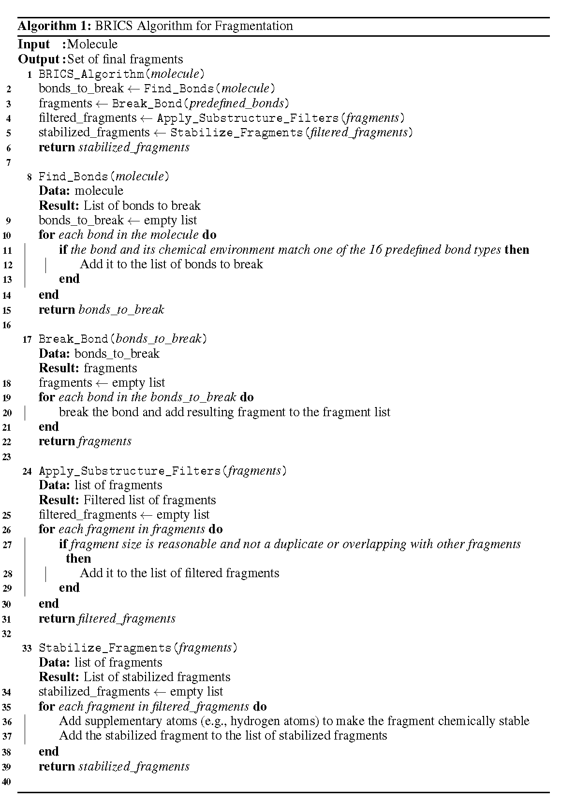

# [ICLR 2024] Long-Short-Range Message-Passing

A comprehensive implementation of Long-Short-Range Message-Passing and state-of-the-art models for molecular dynamics simulation, optimized for Multi-GPU training.

## Table of Contents

- [Overview](#overview)
- [LSR-MP Illustration](#lsr-mp-illustration)
- [BRICS Algorithm](#brics-algorithm)
- [Prerequisites](#prerequisites)
- [Installation](#installation)
- [Usage](#usage)
  - [Single GPU Training](#single-gpu-training)
  - [Multi-GPU Training](#multi-gpu-training)
  - [Testing](#testing)
- [Troubleshooting](#troubleshooting)

## Overview

This repository provides:
- Implementation of Long-Short-Range Message-Passing (LSR-MP)
- Multiple state-of-the-art models for molecular dynamics simulation
- Multi-GPU training optimization
- Support for various fragmentation methods

**Note:** Preprocessing steps may take longer than expected, especially for larger molecular systems. Please be patient during the initial data preparation phase.

## LSR-MP Illustration



## BRICS Algorithm

The Breaking of Retrosynthetically Interesting Chemical Substructures (BRICS) method is widely used in quantum chemistry, chemical retrosynthesis, and drug discovery.

### Key Features:

1. **Bond Dissection**: Compounds are dissected at 16 predefined bond types selected by organic chemists
2. **Environmental Awareness**: Considers chemical environment (atom types) to maintain reasonable fragment sizes
3. **Filtering**: Removes extremely small fragments, duplicates, and overlapping structures
4. **Stabilization**: Adds supplementary atoms (mainly hydrogen) at bond-breaking points for chemical stability

### Visual Representation:




## Prerequisites

Before installation, ensure you have:
- Python 3.7+
- CUDA-compatible GPU(s) for training
- Conda or Miniconda installed
- Git for cloning the repository

### Additional Requirements for E2Former Model

If you plan to use the E2Former model, you must first clone the official E2Former repository:

```bash
git clone https://github.com/2023huang6385/E2Former.git
```

Then modify the path in `lightnp/LSRM/models/e2former_lsrmp.py` (line 14):

```python
# Change this line to point to your E2Former installation
sys.path.append('/path/to/your/E2Former')
```

Replace `/path/to/your/E2Former` with the actual path where you cloned the E2Former repository.

## Installation

### Step 1: Create Environment

Create a new conda environment:
```bash
conda create -n LSR-MP python=3.8
```

### Step 2: Activate Environment

```bash
conda activate LSR-MP
```

### Step 3: Install Dependencies

The main packages required:
- `torch` - PyTorch framework
- `torch-geometric` - Graph neural network library
- `torch-scatter` - Scatter operations for PyTorch
- `ase` - Atomic Simulation Environment
- `rdkit` - Chemical informatics toolkit

Install using the provided script:
```bash
chmod +x build_env.sh
./build_env.sh
```


## Usage

### Supported Components

#### Fragment Assignment Methods:
- **BRICS** (`rdkit`) - Chemical substructure-based fragmentation
- **K-Means Clustering** (`k-means`) - Distance-based clustering
- **Spectral Clustering** (`spectral`) - Graph-based clustering

#### Supported Molecules:
- `Ac_Ala3_NHMe` - Alanine tripeptide
- `DHA` - Docosahexaenoic acid
- `stachyose` - Tetrasaccharide
- `AT_AT` - Adenine-thymine base pairs
- `AT_AT_CG_CG` - Mixed DNA base pairs
- `double_walled_nanotube` - Carbon nanotube structure
- `buckyball_catcher` - Fullerene host-guest complex

#### Available Models:
- **VisNet-LSRM** (`Visnorm_shared_LSRMNorm2_2branchSerial`) - Long-Short Range Message Passing
- **Equivariant Transformer** (`TorchMD_ET`) - Transformer-based approach
- **PaiNN** - Polarizable Atom Interaction Neural Network
- **Equiformer-LSRM** (`dot_product_attention_transformer_exp_l2_md17_lsrmserial`) - E(3)-equivariant transformer with LSRM
- **E2Former** (`E2Former`) - State-of-the-art E(3)-equivariant transformer with direct force prediction

### Single GPU Training

Train LSR-MP on a single GPU:

```bash
CUDA_VISIBLE_DEVICES=0 torchrun --nproc_per_node=1 --master_port=1230 \
  run_ddp.py \
    --datapath ./ \
    --model=Visnorm_shared_LSRMNorm2_2branchSerial \
    --molecule AT_AT_CG_CG \
    --dataset=my_dataset \
    --group_builder rdkit \
    --num_interactions=6 --long_num_layers=2 \
    --lr=0.0004 --rho_criteria=0.001 \
    --dropout=0 --hidden_channels=128 \
    --calculate_meanstd --otfcutoff=4 \
    --short_cutoff_upper=4 --long_cutoff_lower=0 --long_cutoff_upper=9 \
    --early_stop --early_stop_patience=500 \
    --no_broadcast --batch_size=16 \
    --ema_decay=0.999 --dropout=0.1 \
    --wandb --api_key [YOUR_WANDB_API_KEY]
```

For Equiformer-LSRM model, use:

```bash
CUDA_VISIBLE_DEVICES=0 torchrun --nproc_per_node=1 --master_port=1230 \
  run_ddp.py \
    --datapath ./ \
    --model=dot_product_attention_transformer_exp_l2_md17_lsrmserial \
    --molecule AT_AT_CG_CG \
    --dataset=my_dataset \
    --group_builder rdkit \
    --num_interactions=6 --long_num_layers=2 \
    --lr=0.0004 --rho_criteria=0.001 \
    --dropout=0 --hidden_channels=128 \
    --calculate_meanstd --otfcutoff=4 \
    --short_cutoff_upper=4 --long_cutoff_lower=0 --long_cutoff_upper=9 \
    --early_stop --early_stop_patience=500 \
    --no_broadcast --batch_size=16 \
    --ema_decay=0.999 --dropout=0.1 \
    --wandb --api_key [YOUR_WANDB_API_KEY]
```

For E2Former model (state-of-the-art E(3)-equivariant transformer), use:

```bash
CUDA_VISIBLE_DEVICES=0 torchrun --nproc_per_node=1 --master_port=1230 \
  run_ddp.py \
    --datapath ./ \
    --model=E2Former \
    --molecule AT_AT_CG_CG \
    --dataset=my_dataset \
    --group_builder rdkit \
    --num_interactions=6 \
    --lr=0.0004 --rho_criteria=0.001 \
    --dropout=0 --hidden_channels=128 \
    --calculate_meanstd --otfcutoff=4 \
    --short_cutoff_upper=4 \
    --early_stop --early_stop_patience=500 \
    --no_broadcast --batch_size=16 \
    --ema_decay=0.999 --dropout=0.1 \
    --wandb --api_key [YOUR_WANDB_API_KEY]
```

**Note**: E2Former uses direct force prediction via eSCN force blocks and does not utilize long-short range message passing. The model is based on the vanilla E2Former architecture without LSR-MP extensions.

**Important**: Before using E2Former, ensure you have:
1. Cloned the official E2Former repository: `git clone https://github.com/2023huang6385/E2Former.git`
2. Updated the path in `lightnp/LSRM/models/e2former_lsrmp.py` line 14 to point to your E2Former installation

#### Key Parameters:
- `--datapath`: Path to your dataset directory
- `--model`: Model architecture to use
- `--molecule`: Target molecule system
- `--group_builder`: Fragmentation method (rdkit, k-means, spectral)
- `--num_interactions`: Number of interaction layers
- `--lr`: Learning rate
- `--hidden_channels`: Hidden layer dimensions
- `--batch_size`: Training batch size

### Multi-GPU Training

Train using Distributed Data Parallel across multiple GPUs:

```bash
CUDA_VISIBLE_DEVICES=0,1,2,3 torchrun --nproc_per_node=4 --master_port=1230 \
  run_ddp.py \
    --datapath ./ \
    --model=Visnorm_shared_LSRMNorm2_2branchSerial \
    --molecule AT_AT_CG_CG \
    --dataset=my_dataset \
    --group_builder rdkit \
    --num_interactions=6 --long_num_layers=2 \
    --lr=0.0004 --rho_criteria=0.001 \
    --dropout=0 --hidden_channels=128 \
    --calculate_meanstd --otfcutoff=4 \
    --short_cutoff_upper=4 --long_cutoff_lower=0 --long_cutoff_upper=9 \
    --early_stop --early_stop_patience=500 \
    --no_broadcast --batch_size=16 \
    --ema_decay=0.999 --dropout=0.1 \
    --wandb --api_key [YOUR_WANDB_API_KEY]
```

#### Important Notes:
- `--nproc_per_node` must equal the number of GPUs in `CUDA_VISIBLE_DEVICES`
- `--otfcutoff` must equal `--short_cutoff_upper` (defines short-range graph radius)
- Use `--wandb` with your API key for experiment tracking
- Recommended settings provide good MD22 benchmark performance

### Testing

Evaluate a trained model:

```bash
CUDA_VISIBLE_DEVICES=0 python -m torch.distributed.launch --nproc_per_node=1 --master_port=1230 run_ddp.py \
  --datapath [YOUR_DATA_PATH] \
  --model=Visnorm_shared_LSRMNorm2_2branchSerial \
  --molecule AT_AT_CG_CG \
  --dataset=[DATASET_NAME] \
  --test --restore_run [PATH_TO_TRAINED_MODEL] \
  --wandb --api_key [YOUR_WANDB_API_KEY]
```

#### Evaluation Metrics:
- **Force MAE** - Mean absolute error for atomic forces
- **Energy MAE** - Mean absolute error for system energy

## Troubleshooting

### Common Issues:

1. **CUDA Out of Memory**: Reduce `--batch_size` or use fewer `--hidden_channels`
2. **Preprocessing Delays**: Large molecular systems may require extended preprocessing time
3. **Port Conflicts**: Change `--master_port` if the default port is occupied
4. **Missing Dependencies**: Ensure all packages are installed via `build_env.sh`

### Performance Tips:

- Use multiple GPUs for faster training on large datasets
- Adjust cutoff parameters based on your molecular system size
- Monitor training with wandb for optimal hyperparameter tuning


